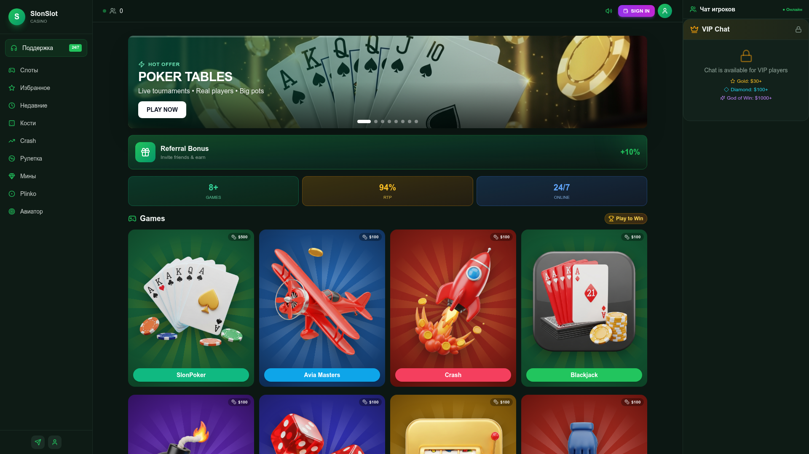

# 🎰 SlonSlot Casino — Premium Telegram Mini App

> **A production-ready, full-stack casino platform built natively for Telegram. Eight in-house games, real-time multiplayer, an admin back-office, and a cinematic UI — ready to launch.**

🌐 **Live demo:** [slonslot.com](https://slonslot.com)
💬 **Buy / inquire:** Telegram [@Nahalist](https://t.me/Nahalist) — *price on request*

---

---

## ✨ Why this project?

SlonSlot Casino is a turn-key gambling platform purpose-built for the **Telegram Mini App** ecosystem — where 800M+ users already live. No app-store gatekeeping, no install friction, no payment-rail headaches: players open the bot, tap **Play**, and they're in.

The codebase is **modern, typed, and battle-tested**, with eight original games, a poker engine with real-time WebSocket tables, an analytics dashboard, a referral program, and a complete admin panel. It is sold as a **complete, ready-to-deploy product** — not a template.

---

## 🎮 What's inside

### Eight original games

| Game | Type | Highlights |
|------|------|------------|
| 🃏 **SlonPoker** | Multi-table poker | Live tables, real-time WebSocket, hand evaluator, blinds & antes |
| ✈️ **Avia Masters** | Crash / collect | 60 fps canvas, 3D plane & missile, 50 pre-baked outcomes, configurable RTP |
| 🚀 **Crash** | Multiplier crash | Smooth real-time curve, cash-out timing, animated graph |
| ♠️ **Blackjack** | Card game | Full rule set, split / double / insurance |
| 💣 **Mines** | Field discovery | Adjustable bomb count, dynamic odds preview |
| 🎲 **Dice** | Pure RNG | Slider odds, instant resolution |
| 🎰 **Slots** | Reel game | Animated reels, paylines, bonus symbols |
| 🎡 **Roulette** | Classic European | Inside / outside bets, betting history |
| 💎 **Plinko** | Physics game | Multipliers, risk levels, ball physics |
| 🤚 **Pulse** *(more)* | Skill / reflex | Several extra mini-games |

### Platform features

- 🔐 **Telegram Login** — frictionless auth via Telegram WebApp `initData` (HMAC-verified)
- 💬 **Live player chat** — VIP-tiered (Gold $30+, Diamond $100+, God of Win $1000+)
- 🎁 **Referral program** — 10% lifetime revenue share, automatic credit
- 🏆 **Raffles & promotions** — admin-scheduled, auto-resolved
- 📊 **Analytics dashboard** — DAU, GGR, NGR, top players, game-mix charts (Recharts)
- 🛠 **Admin panel** — user management, balance adjustments, RTP control, broadcast messages
- 💰 **Wallet & history** — deposits, withdrawals, transaction log
- 🌍 **Bilingual** — RU / EN out of the box
- 📱 **Mobile-first responsive** — pixel-perfect inside Telegram on iOS & Android
- 🎵 **Sound design** — original SFX library + haptic feedback via Telegram WebApp API

---

## 🛠 Tech stack

A modern, hireable, well-supported stack with no exotic dependencies:

**Frontend**
- React 18 + TypeScript
- Vite (HMR, lightning-fast dev loop)
- Tailwind CSS 3 + Radix UI primitives
- Wouter (lightweight routing)
- TanStack Query (data layer)
- Recharts (analytics)
- Framer Motion (micro-interactions)
- HTML5 Canvas (game rendering, faux-3D effects)

**Backend**
- Express + TypeScript
- WebSocket (`ws`) for live tables & chat
- Drizzle ORM + PostgreSQL
- Telegram Bot API (`node-telegram-bot-api`)
- Zod (request validation)
- Express-session (server-side sessions)

**Ops**
- pnpm monorepo
- Production build: single command, single artifact
- Deployable to any Node host (VPS, Render, Railway, Replit Deploy)
- Postgres-only persistence (no Redis required)

---

## 📂 Code samples in this repo

A few hand-picked files live in [`/examples`](examples/) so you can judge code quality before you buy:

- [`AviaMastersGame.tsx`](examples/AviaMastersGame.tsx) — ~1,300 LoC of canvas game code with faux-3D rendering, deterministic outcomes, throttled HUD updates, and unmount-safe settlement.
- [`aviamastersTemplates.ts`](examples/aviamastersTemplates.ts) — server-side outcome generator with seeded PRNG, 50 pre-baked flight scripts, and runtime sanity checks.
- [`package.json`](examples/package.json) — full dependency manifest.

> The complete source is delivered to the buyer after purchase. This repository is a **showcase**, not the product.

---

## 🔥 Highlights you won't see elsewhere

- **Deterministic, scripted outcomes**: every Avia Masters round is one of 50 pre-baked templates picked by the admin's win-rate dial — visually rich animations, mathematically auditable payouts.
- **3D-styled 2D canvas**: layered shading, perspective wings, propeller motion blur, multi-stage exhaust flames — no WebGL required, runs at 60 fps on a $100 phone.
- **Race-free game loop**: stable refs + inline rAF resolution avoid the React state-thrash trap that breaks most canvas games in production.
- **Server-authoritative payouts**: client-side animations always converge to a server-computed outcome — no way for a malicious client to "cash out" early.
- **Telegram-native polish**: haptic feedback, theme adaptation, back-button handling, share-game flow, bot deep links.

---

## 📸 More screens

> Full visual tour, video walk-through, and live admin demo provided to serious buyers on request.

---

## 💼 What you get on purchase

- Complete source code (frontend + backend + admin)
- Database schema + migration scripts
- Original sound assets & game art
- Telegram bot deployment guide
- Production deployment guide (1-page)
- Optional: 30 days of installation support

**Pricing:** flexible — single-license, white-label, or full IP transfer.
**Get a quote:** Telegram [@Nahalist](https://t.me/Nahalist)

---

## 📜 License

Source code shown in this repository is for **evaluation purposes only**. All rights reserved. Commercial use, redistribution, and derivative works require a paid license from the author. See [`LICENSE`](LICENSE) for details.

---

## 🤝 Contact

| | |
|---|---|
| 🌐 Website | [slonslot.com](https://slonslot.com) |
| 💬 Telegram | [@Nahalist](https://t.me/Nahalist) |
| 🎰 Live bot | [@SlonSlot_bot](https://t.me/SlonSlot_bot) |

> *Serious inquiries only. Demo access available on request.*
